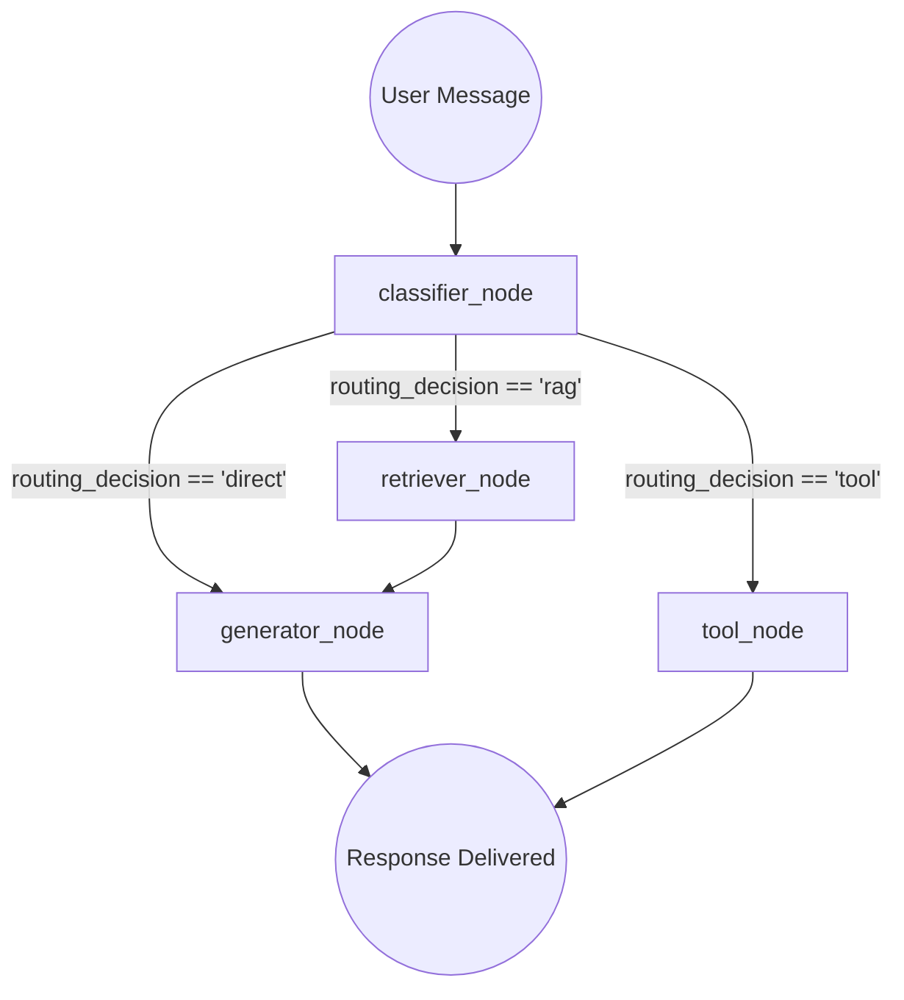

# ✈️ AI Travel Concierge AI Agent (Weeks 1–2 Milestone)

A modular, production-ready document RAG chatbot and travel assistant designed for Weeks 1–2 of the internship curriculum (Track B). This application is powered by **Streamlit**, **LangChain**, and **LangGraph**, and is optimized for local execution and direct deployment to **Streamlit Cloud**.

---

## 🚀 Quick Start (Local Run)

### 1. Prerequisites
Ensure you have **Python 3.11+** installed.

### 2. Clone and Setup Environment
```bash
# Clone the repository and navigate to directory
cd "AI Travel Concierge AI Agent"

# Create a virtual environment
python3 -m venv .venv

# Activate the virtual environment
# On Linux/macOS:
source .venv/bin/activate
# On Windows:
.venv\Scripts\activate
```

### 3. Install Dependencies
```bash
pip install --upgrade pip
pip install -r requirements.txt
```
*(Note: Since we built a custom zero-dependency local embedding class, you do **not** need to install heavy machine learning packages like PyTorch or sentence-transformers to run the local RAG database).*

### 4. Configuration
Duplicate the example environment file and configure your API keys:
```bash
cp .env.example .env
```
Open `.env` in a text editor and populate your keys:
```env
GOOGLE_API_KEY=your_gemini_api_key_here
LLM_PROVIDER=gemini
LLM_MODEL=gemini-1.5-flash

# Default to "local" to run in-memory hashing embeddings (zero model downloads needed!)
EMBEDDING_PROVIDER=local
```

### 5. Launch the Application
```bash
streamlit run streamlit_app.py
```

### 6. Run Test Suite
```bash
python3 -m pytest tests/
```

---

## 🌐 Streamlit Cloud Deployment

This project is structured for easy, serverless execution on **Streamlit Cloud** with a local FAISS index (`faiss-cpu`) that requires zero database instance hosting.

### Step-by-Step Deployment:
1. **GitHub Repository**: Commit and push this codebase to a GitHub repository.
2. **Sign In**: Log into [Streamlit Share](https://share.streamlit.io/) using your GitHub account.
3. **New App**: Click **"New app"** and select your repository, branch (`main`), and set the main file path as `streamlit_app.py`.
4. **Secrets Configuration**: Before clicking deploy, click **"Advanced settings..."** and copy the required environment variables into the **Secrets** text area (e.g.):
   ```toml
   GOOGLE_API_KEY = "AIzaSy..."
   LLM_PROVIDER = "gemini"
   LLM_MODEL = "gemini-1.5-flash"
   EMBEDDING_PROVIDER = "local"
   ```
5. **Deploy**: Click **"Deploy!"** and your RAG app will build and go live in minutes.

---

## 🧠 LangGraph Workflow Architecture

This project organizes the travel concierge chatbot into a modular graph compiled with **LangGraph**:



### Workflow Node Explanations:
1. **Classifier (`classifier_node`)**: Evaluates the user query against custom keywords (e.g. *'summarize'* or *'list'*) to decide whether to trigger analytical tools. If the user asks standard questions and files exist, it routes to `retriever`. If no files are loaded, it routes to `direct` chat fallback.
2. **Retriever (`retriever_node`)**: Performs a similarity search on the local FAISS database for the user query, loading text chunks and source metadata, and updating the state.
3. **Tool (`tool_node`)**: Runs in-memory corpus analytical tools (`summarize_corpus_tool` or `list_documents_tool`) returning statistics on files, character counts, and index sizes.
4. **Generator (`generator_node`)**: Calls the configured LLM provider (using `ChatGoogleGenerativeAI` for Gemini). In RAG mode, it injects strict grounding prompts instructing the model not to hallucinate if the answer is missing from the text context.

---

## 🛡️ Zero-Dependency Local Embeddings (`SimpleHashingEmbeddings`)

To prevent complex API key permission conflicts and heavy PyTorch package downloads, this app implements a custom `SimpleHashingEmbeddings` class.
* It parses text content into frequency-based hashes of fixed dimension.
* When combined with FAISS similarity search, it functions as a highly efficient keyword/concept matching search.
* This operates entirely offline, executes in milliseconds, and has **zero** package weight.

---

